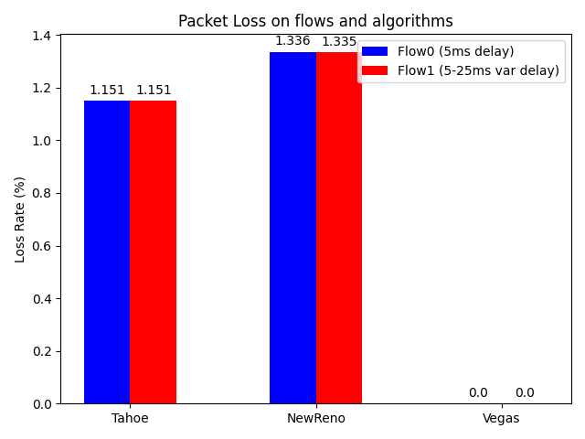

A comparsion on network congestion control algorithms on TCP connection using ns2 simulation
====================
If the traffic in the network exceeds the network capacity, congestion is introduced in the network which creates packet loss.
While tcp connection is used for data transmission congestion is controlled through automatic adjustment of the data transmission rate.
Here we plot average congestion window size change (CWND), Goodput, Packet Loss rate and RTT for two traffic flows with TCP connection during 1000 ms for 10 iterations. 


### NS2 Installation on mint17
Nam is also needed to install. Nam (Network Animator) is an animation tool to graphically represent the network and packet 
traces.

```
sudo apt-get install -y nam
sudo apt-get install -y ns2
sudo apt install tclsh 
```
use Tcl (Tool Command Language) for Simulation. 


### To start simulation run:

`./start.sh`

* Network simulation iteration numbers is configurable in start.sh file.
* The .png flows plots stored in /img folders.
* The .tr trace files stored in /traces used to calculate congestion parameters.
* The .nam trace files stored in /nams used for network animator.

* Uncomment line 51 in sim.tcl (finish function) to get ns2 topology animations.

`51 # exec nam ${nam_path}${simtype}.nam &`


* Average characteristics (CWND, Goodput, Loss rate and RTT) plots auto saved in /img.



There is fairness for loss in the flows, congestion avoidance algorithm is effective, for example "Vegas" has a loss rate of zero, simply because it never overflows the queue.

- Any question? feel free to mail 
 [Amirhosein_Morteza@yahoo.com](https://Amirhosein_Morteza@yahoo.com) 
