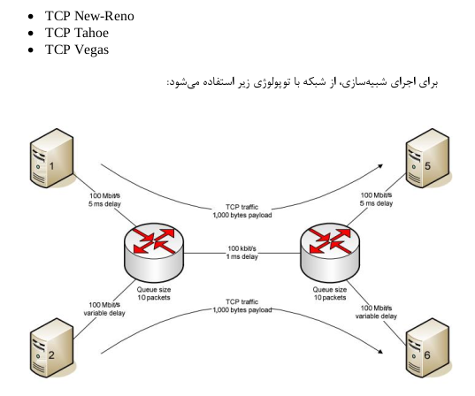
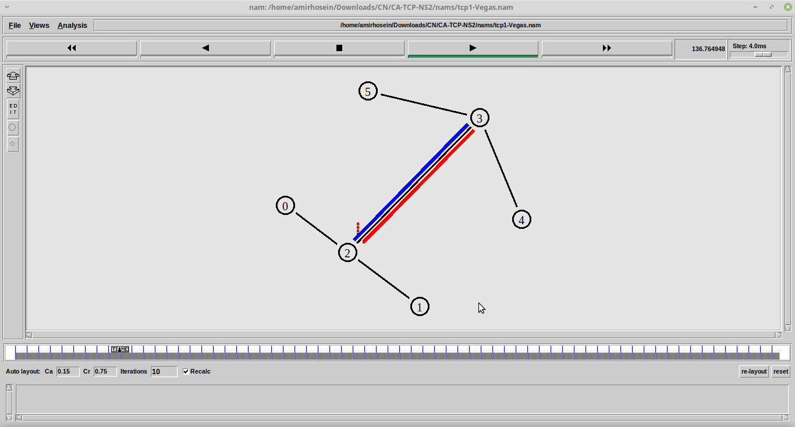

A comparsion on network congestion control algorithms on TCP connection using ns2 simulation
====================

Here we plot average congestion window size change (CWND), Goodput, Packet Loss rate and RTT for two traffic flows with TCP connection during 1000 ms for 10 iterations. 

### To start simulation run:

`./start.sh`

* Network simulation iteration numbers is configurable in start.sh file.
* The .png flows plots stored in /img folders.
* The .tr trace files stored in /traces used for ploting.
* The .nam topology animation files stored in /nams used for network animator.

* to get ns2 topology animations uncomment line 51 in sim.tcl finish function.

`51 # exec nam ${nam_path}${simtype}.nam &`

- Any question? feel free to mail 
 [Amirhosein_Morteza@yahoo.com](https://Amirhosein_Morteza@yahoo.com) 
